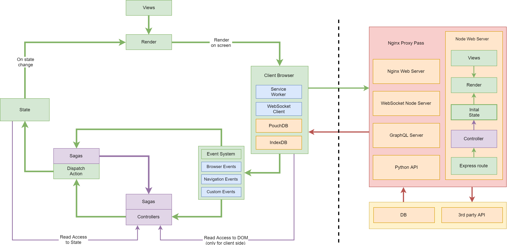

# Drmzn todo app

Simple demo of TODO MVC app, using React or Mustache as view.

``yarn install``

``yarn build``

``yarn start``

visit localhost:3000

To change the view from React to Mustache, uncomment Mustache methods in app.ts and server.ts.

# Event → Controller → State → View

***Simple architecture for building complex JavaScript applications***

Inspired from MVC, Clean Architecture and Design and Immutable User Interfaces and embracing the principles of immutability and functional programming, the architecture provides clear separation of concerns. It consists of four parts. Each part is independent from the others and you can use any implementation that is suiting your needs.

### Event

All user interactions are events, route change also. All events are handled by the event delegation system, that invokes the Controller.

### Controller

The controller is async function, that receives the initialized Store and the params from Event. Controller executes the business logic and dispatches an action to the Store. The controller can be Redux Saga. It can dispatch many actions at once or over time.

### State

The state is nested object. It has a tree like structure and represents the data model of our app. Cannot be mutated and can be updated only with dispatch action by the controller. Redux Store holds our State. The store is initialized on startup and is passed to controllers. The Render is subscribed to the Store.

### View

View can be anything (Mustache, string literals, etc.), but we're using React components for our views.

##### Part 1: Server Side

Step 1. Visitor types url in his browser url bar and sends a request to the web server.

Step 2. Web server receives the request and invokes Controller on Node Express Web Server via Nginx.

Step 3. Controller calls method with parameters, does the work and dispatches an action to the Store. Store generates the Initial State for our app.

Step 4. Render function on the server takes the initial state and App to generate the response html via React SSR. The initial state is passed to client-side as global variable via response html as script tag. (Hydration)

Step 5. Client-side (browser), receives the response from the server and renders html on the screen.

Step 6. Service workers are installing.

Step 7. The app is loaded asynchronously after the Browser has rendered the response. The store is initialized with initial state (dehydration). Service worker is installed.

##### Part 2: Client side

Step 8. User does an interaction — example — clicks on native link — a href element, the Event System is intercepting the click and invokes the according controller/method with specified parameters.

Step 9. Controller executes business logic and dispatches an action to store to update the state. The controller can access private methods, functions, Utils, external resources, 3rd party APIs. Controllers are asynchronous and can dispatch multiple actions.

Step 10. Store receives dispatch action from controller and updates the state.

Step 11. Render function is subscribed to the Store and when state changes it renders our React app. Render function is de-bounced and renders only once, after the last state change in the same stack call.

Step 12. React applies the diff changes to current DOM Tree and render is complete. Target render time < 16ms.

Step 13. If all PWA criteria are met, the user can install the app on his mobile and desktop devices like a native application.

##### Part 3: Service Worker

Step 14. Later, the user visits the url of our app with his browser or opens it via the installed app. Service Worker is loading the application shell instantly. The content is loaded, based on specified caching strategy. The application is initialized from client-side.

## Links

- [Robert C Martin - Clean Architecture and Design (video)](https://www.youtube.com/watch?v=Nsjsiz2A9mg)
- [Lee Byron - Immutable User Interfaces (video)](https://www.youtube.com/watch?v=pLvrZPSzHxo)
- [Robert C Martin - Functional Programming; What? Why? When? (video)](https://www.youtube.com/watch?v=7Zlp9rKHGD4)
- [John Ousterhout - A Philosophy of Software Design (video)](https://www.youtube.com/watch?v=bmSAYlu0NcY)
- [Martin Fowler - The Many Meanings of Event-Driven Architecture (video)](https://www.youtube.com/watch?v=STKCRSUsyP0)
- [Mike G. Miller - Professional Software Development (book)](https://mixmastamyk.bitbucket.io/pro_soft_dev/index.html)
- [Addy Osmani - Learning JavaScript Design Patterns (book)](https://addyosmani.com/resources/essentialjsdesignpatterns/book/#designpatternsjavascript)
- [Robert C Martin - UncleBob Expecting Professionalism (video)](https://www.youtube.com/watch?v=BSaAMQVq01E)
- [Revealing Module Pattern Javascript Tutorial (video)](https://www.youtube.com/watch?v=pOfwp6VlnlM)
- [Michele Bertoli - setState Machine (video)](https://www.youtube.com/watch?v=sZg3DoTfHLQ)
- [Dan Abramov - The Redux Journey (video)](https://www.youtube.com/watch?v=uvAXVMwHJXU)
- [Pub/Sub Javascript Design Pattern Tutorial (video)](https://www.youtube.com/watch?v=nQRXi1SVOow)
- [Dan Abramov - React as a UI Runtime (blog)](https://overreacted.io/react-as-a-ui-runtime/)
- [Nicole Sullivan: Style Guide Driven Development (video)](https://www.youtube.com/watch?v=ldW7zVmqu5g)
- [What Does It Take To Be An Expert At Python? (video)](https://www.youtube.com/watch?v=7lmCu8wz8ro)
- [The Beauty Of Bad Code (video)](https://www.youtube.com/watch?v=y_XLqYQ8MDA)
